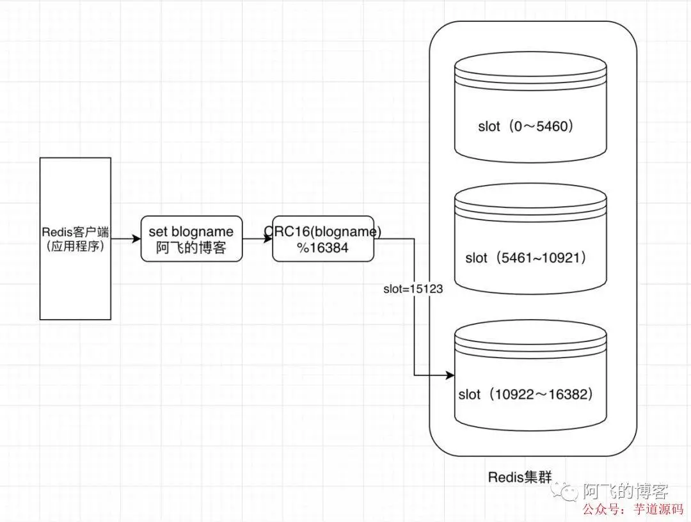
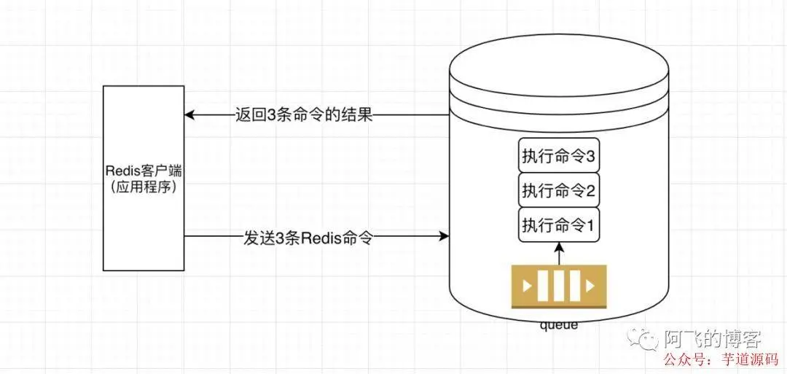

## 4次优化，我把 Redis 性能 “压榨” 到极致！

以下文章来源于阿飞的博客 ，作者阿飞的博客

- 第1次优化
- 第2次优化
- 第3次优化
- 第4次优化
- 注意事项

------

我们有个这样的需求：每天每一个抢购商品只能买一次，并且全场抢购商品总购买次数不允许超过5次。

那么，整个商品限购的流程大概如下图所示：[](https://mp.weixin.qq.com/s?__biz=MzUzMTA2NTU2Ng==&mid=2247487551&idx=1&sn=18f64ba49f3f0f9d8be9d1fdef8857d9&scene=21#wechat_redirect)

那么，在每次购买成功商品成功后，发送的MQ大概是这样的（假设当前这笔订单有两件抢购商品）：

```json
[{
  "orderId": "2020020622000001",
  "orderTime": "1581001673012",
  "productId": "599055114591",
  "userId": "860000000000001",
  "merchantCode": "A045"
}, {
  "orderId": "2020020622000001",
  "orderTime": "1581001673012",
  "productId": "599055114592",
  "userId": "860000000000001",
  "merchantCode": "A045"
}]
```

这条消息表示860000000000001这个用户在1581001673012这个时间点（北京时间为2020/02/06 23:07:53）在A045这个商户分别购买了商品ID为599055114591和599055114592两样商品。

那么，当消费这条信息后，更新频控的几条关键Redis命令如下（上面的需求不是重点，优化下面5条命令才是本文的重点）：

```shell
命令1：hset mall:sale:freq:ctrl:860000000000001 599055114591 1（hash结构，field表示购买的商品ID，value表示购买次数）
命令2：hset mall:sale:freq:ctrl:860000000000001 599055114592 2
命令3：expire mall:sale:freq:ctrl:860000000000001 3127（设置过期时间）
命令4：set mall:total:freq:ctrl:860000000000001 3
命令5：expire mall:total:freq:ctrl:860000000000001 3127（设置过期时间）
```

我们首先了解一下执行一条Redis命令耗时由哪几部分组成：

发送命令网络传输时间，命令在Redis服务端队列中等待的时间，命令执行的时间（Redis中的slowlog只是检测这一步骤的时间），结果返回的Redis客户端的时间。

如下图所示：[](https://mp.weixin.qq.com/s?__biz=MzUzMTA2NTU2Ng==&mid=2247487551&idx=1&sn=18f64ba49f3f0f9d8be9d1fdef8857d9&scene=21#wechat_redirect)

上面的业务总计涉及5条Redis命令，每条命令都需要经过这些步骤，可想而知性能真的弱爆了（可能整个执行过程还不需要10ms，但还是弱爆了）。

## 第1次优化

第一次优化非常简单，稍微有点经验就能看出来，利用hmset命令将两条hmset命令合二为一，优化后的Redis命令如下：

```
hmset mall:sale:freq:ctrl:860000000000001 599055114591 1 599055114592 2
expire mall:sale:freq:ctrl:860000000000001 3127
        
setex mall:total:freq:ctrl:860000000000001 3127 3
```

> 推荐下自己做的 Spring Boot 的实战项目：
>
> https://github.com/YunaiV/ruoyi-vue-pro

## 第2次优化

第二次优化将set和expire命令合二为一，这个一般对Redis有点了解的也知道如何优化：

```
pipeline(
  hmset mall:sale:freq:ctrl:860000000000001 599055114591 1 599055114592 2
  expire mall:sale:freq:ctrl:860000000000001 3127
)

-- mall:total:freq:ctrl:860000000000001和mall:sale:freq:ctrl:860000000000001两条命令不在同一个slot上，所以需要单独执行下面这条命令
setex mall:total:freq:ctrl:860000000000001 3127 3
```

> 推荐下自己做的 Spring Cloud 的实战项目：
>
> https://github.com/YunaiV/onemall

## 第3次优化

第3次优化需要借助pipeline，简直就是Redis优化的一大杀器。

不过，需要注意的是在**RedisCluster中使用pipeline时必须满足pipeline打包的所有命令key在RedisCluster的同一个slot上** 。

如果打包命令的key不在同一个slot上，就会报错。所以我们需要分两批打包：

```
pipeline(
  hmset mall:sale:freq:ctrl:860000000000001 599055114591 1 599055114592 2
  expire mall:sale:freq:ctrl:860000000000001 3127
)

-- mall:total:freq:ctrl:860000000000001和mall:sale:freq:ctrl:860000000000001两条命令不在同一个slot上，所以需要单独执行下面这条命令
setex mall:total:freq:ctrl:860000000000001 3127 3
```

经过第3次的优化后，这些命令还是需要2次网络交互。较劲的我还是不甘心，想要将其优化到只需要一次网络交互即可，有没有办法？

当然有！

## 第4次优化

这次优化利用了一个高级特性：**hashtag**

是啥子意思呢？我们知道，RedisCluster总计有16*1024=16384个slot。那么执行一条Redis命令时，其key对应的是哪个slot呢？是利用这样一个计算公式得到的：**slot = CRC16(key)%16384**

示意图如下：



也就是说，默认情况下，key在哪个slot上，与key有关。那么，我们能否只**让key在哪个slot上与部分key有关** 呢？

当然可以，这就是hashtag特性。用法非常简单，假设一个key是mall:sale:freq:ctrl:860000000000001，我们只需要用{}将key中我们需要的那部分包括起来即可。

例如，我们只想让其根据用户IMEI计算即可，那么key是这样的：mall:sale:freq:ctrl:{860000000000001}。只要key中有{860000000000001}这一部分，就一定落在同一个slot上。

所以，第四次优化以后的命令执行如下所示：

```shell
pipeline(
  hmset mall:sale:freq:ctrl:${860000000000001} 599055114591 1 599055114592 2
  expire mall:sale:freq:ctrl:${860000000000001} 3127
  setex mall:total:freq:ctrl:${860000000000001} 3127 3
)
```

优化后，5条Redis命令压缩到3条Redis命令，并且3条Redis命令只需要发送一次，并且结果也一次就能全部返回。简直**完美！** ！

## 注意事项

我们在使用hashtag特性时，一定要注意，**不能把key的离散性变得非常差** 。

以本文为例，没有利用hashtag特性之前，key是这样的：mall:sale:freq:ctrl:860000000000001，很明显这种key由于与用户相关，所以离散性非常好。

而使用hashtag以后，key是这样的：mall:sale:freq:ctrl:{860000000000001}，这种key还是与用户相关，所以离散性依然非常好。

我们千万不要这样来使用hashtag特性，例如将key设置为：mall:{sale:freq:ctrl}:860000000000001。

这样的话，无论有多少个用户多少个key，其{}中的内容完全一样都是sale:freq:ctrl，也就是说，所有的key都会落在同一个slot上，导致整个Redis集群出现严重的倾斜问题。