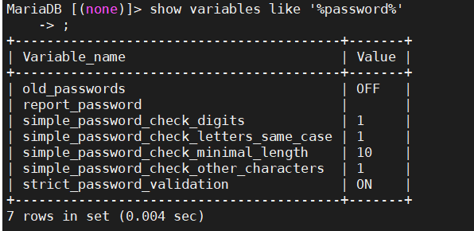

## MYSQL插件机制

### 插件机制

#### 1. 插件相关命令

```shell
#查看插件so目录 
show variables like '%plugin_dir%';
#查看已安装的插件
show plugins;
#查看包含的插件
SELECT plugin_name FROM information_schema.all_plugins;
#安装插件
install plugin   simple_password_check soname 'simple_password_check.so';
#卸载插件
uninstall plugin simple_password_check;

```

#### 2. 密码复杂度校验

- 插件simple_password_check

  - `simple_password_check`是[密码验证](https://mariadb.com/kb/en/password-validation-plugin-api/)插件。它可以检查密码是否至少包含一定数量的特定类型的字符。首次安装时，密码必须至少为八个字符，并且至少需要一个数字，一个大写字母，一个小写字母以及一个既不是数字也不是字母的字符。

  - 请注意，如果[strict_password_validation](https://mariadb.com/kb/en/server-system-variables/#strict_password_validation)变量为`OFF`（`ON`默认情况下），则可以将密码直接设置为哈希，而无需密码验证。

  - 说明地址：https://mariadb.com/kb/en/simple-password-check-plugin/

  - 检验是否成功

    ```shell
    #创建密码为111的测试用户
    create user 'wlh1'@'localhost' identified by '111';
    #提示失败:ERROR 1819 (HY000): Your password does not satisfy the current policy requirements
    #创建密码为Abcd1234!的测试用户成功
    create user 'wlh1'@'localhost' identified by 'Abcd1234!';
    
    #使用set password命令需要校验，直接修改数据库不需要校验
    ```

  - 配置密码复杂度

    ```shell
    #查看设置
    show variables like '%password%';
    #临时生效
     set GLOBAL simple_password_check_minimal_length=10;
     #永久生效
     vi /etc/my.cnf.d/mariadb-server.cnf
     #在character-set-server=utf8下面增加下面
    simple_password_check_minimal_length=10
    #密码默认周期
    default_password_lifetime=7
    ```

    

  - 

- 插件validate_password

  https://blog.csdn.net/zhangxueleishamo/article/details/103348187

#### 3. 忘记root密码，修改密码

- 修改服务启动命令

  ```shell
  #查数据库服务
  systemctl status mariadb
  #修改服务命令，增加参数：skip-grant-tables
  vi /usr/lib/systemd/system/mariadb.service
  #修改一下内容
  ExecStart=/usr/libexec/mysqld --skip-grant-tables --basedir=/usr $MYSQLD_OPTS $_WSREP_NEW_CLUSTER  --user=root
  #重新加载服务配置
  systemctl daemon-reload
  #然后可root登录，修改密码
  #修改密码-1
  use mysql;
  desc user;
  update user set authentication_string=password('Abcd1234!') where user='root';
  #修改密码-2
  set password for  wlh1@localhost = password('111');
  #修改密码-3
  mysqladmin -uwlh1 -pAbcd1234! password 'ABcd1234!';
  ```

  

- 


