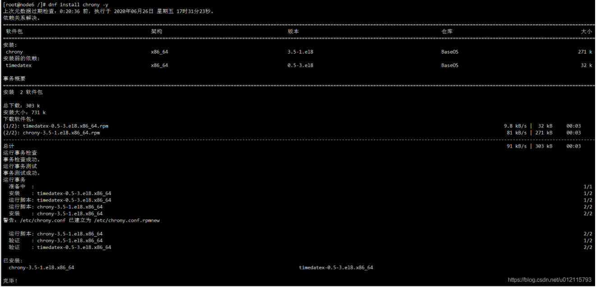
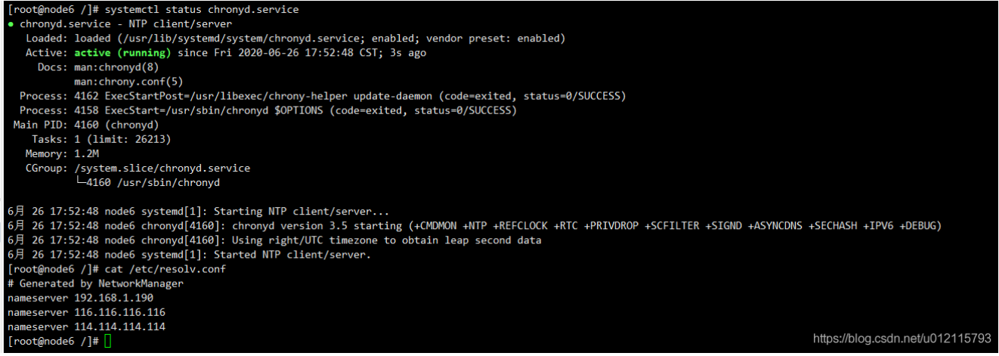
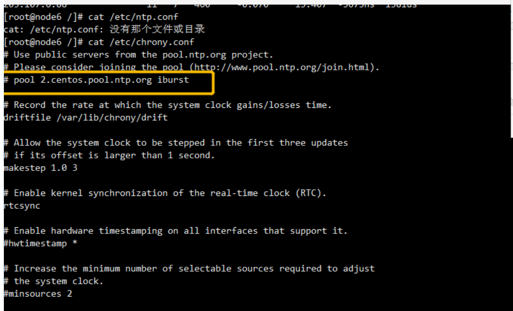
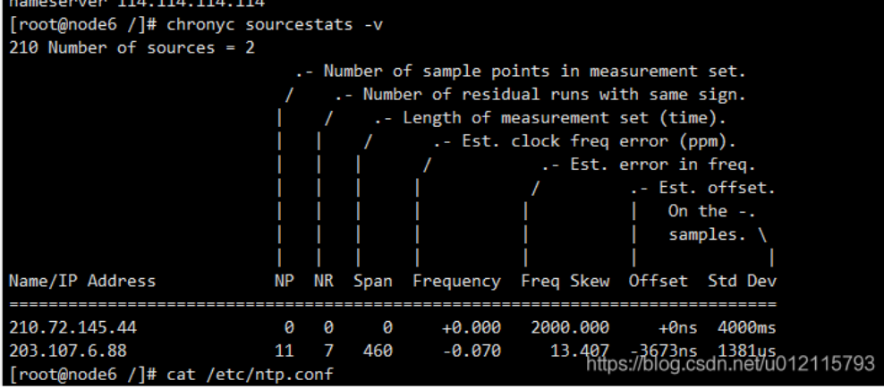
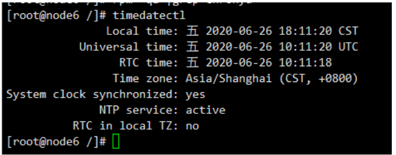

## V2ray安装部署


### 问题

- V2ray-Core连接出现下面错误

  - **错误信息：**

    [Warning] failed to handler mux client connection > v2ray.com/core/proxy/vme

  - 原因：

    由于服务器与客户端的时间不同步

  - 解决方式：

    - 服务器安装时间同步程序ntp

    - centos 8 ntp修改为chronyc

      - 同步命令

        ```shell
        chronyc sources -v
        ```

      - 安装

        ```shell
        dnf install chrony -y
        ```

        

      - 启动服务

        ```shell
        systemctl start chronyd.service
        ```

      - 查看服务状态

        ```shell
        systemctl status chronyd.service
        ```

        

      - 修改时间同步服务

        ```shell
        vim /etc/chrony.conf
        ```

        

        注释掉

        ```shell
        #pool 2.centos.pool.ntp.org iburst
        
        加入新的时间服务器
        
        server 210.72.145.44 iburst
        server ntp.aliyun.com iburst
        ```

      - 重启服务

        systemctl restart chronyd.service

      - 时间同步

        chronyc sourcestats -v

        

      - 查看本机时间

        timedatectl

        

      - 

    - 

    

  - 

- 自动化配置

  - https://ssrvps.org/archives/9372